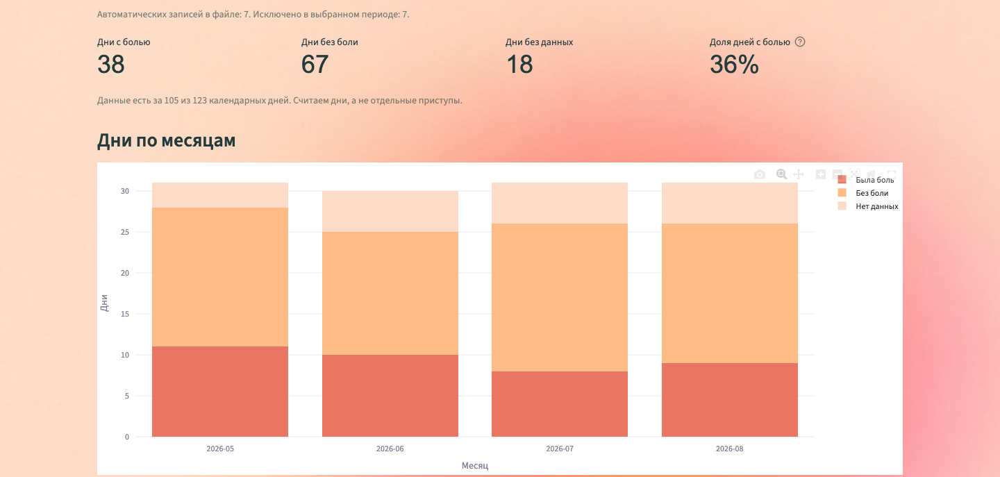
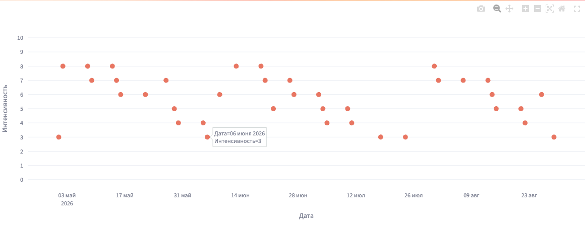

<div align="center">
  
  <h1>MigreBot Analytics</h1>
  <p><strong>История головной боли — в понятных графиках.</strong></p>
  <p>CSV из Migrebot · Дневная и месячная статистика · Интенсивность боли</p>
  <p><code>Python 3.13</code> · <code>Streamlit</code> · <code>pandas</code> · <code>Plotly</code></p>
</div>



<p align="center"><em>Интерфейс приложения. На всех скриншотах — вымышленные данные.</em></p>

## Возможности

| | Что показывает приложение |
| --- | --- |
| **Сводка за период** | Дни с болью, без боли и без данных; доля дней с болью |
| **Динамика по месяцам** | Распределение календарных дней по состояниям |
| **Интенсивность боли** | Внесённые оценки от 0 до 10 и их среднее |
| **Фильтры** | Диапазон дат и учёт автоматических записей |
| **Исходные записи** | Таблица загруженных данных и сводка по дням |
| **Демонстрационный режим** | Знакомство с интерфейсом без личной выгрузки |

Загрузка CSV → выбор периода → сводка и графики. Регистрация не требуется.

## Интерфейс

### Приветствие

Первый экран с вводом имени и информацией о дневнике.


### Интенсивность боли

Каждая точка соответствует заполненной оценке. Дата и значение доступны при наведении; график поддерживает масштабирование.



## Локальный запуск

Требуется Python 3.13.

```bash
git clone https://github.com/mmirumm/HEADACHE-ANALYTICS.git
cd HEADACHE-ANALYTICS
python3.13 -m venv .venv
source .venv/bin/activate
python -m pip install -r requirements.txt
python -m streamlit run app.py
```

Приложение доступно по адресу [localhost:8501](http://localhost:8501).

Перезапуск на macOS:

```bash
.venv/bin/python restart_streamlit.py
```

## Формат CSV

| Поле | Формат | Обязательное |
| --- | --- | :---: |
| `Дата` | `ГГГГ-ММ-ДД` | Да |
| `Головная боль` | `Да`, `Нет` или пустое значение | Да |
| `Интенсивность боли` | Число от 0 до 10 | Нет |
| `Комментарии` | Текст; используется для определения автоматических записей | Нет |

Поддерживаются UTF-8, Windows-1251 и разделители «запятая», «точка с запятой», «табуляция». Размер файла — до 5 МБ. Дополнительные столбцы доступны в таблице исходных записей.

<details>
<summary>Минимальный пример CSV</summary>

```csv
Дата,Головная боль,Интенсивность боли,Комментарии
2026-08-01,Нет,,
2026-08-02,Да,6,
2026-08-03,Да,4,
```

</details>

## Правила расчёта

- **Единица учёта — календарный день.** При нескольких записях за одну дату ответ «Да» имеет приоритет.
- **Пропуски выделяются отдельно.** Отсутствие записи или пустой ответ не означает отсутствие боли.
- **Доля дней с болью** рассчитывается среди дней с ответом «Да» или «Нет».
- **Автоматические записи** исключены по умолчанию. Их можно включить в фильтрах.
- **Средняя интенсивность** учитывает только заполненные оценки в записях с болью. Пропуски не заменяются нулями.
- **Границы периода** применяются и к месячной статистике: неполный месяц содержит только выбранные дни.

Количество отдельных приступов и их точная длительность не рассчитываются: доступных полей выгрузки для этого недостаточно.

## Обработка данных

CSV обрабатывается в памяти приложения и не сохраняется на диск. При локальном запуске обработка выполняется на компьютере пользователя; при размещении на сервере — на сервере. Полный перезапуск сбрасывает имя, выбранный файл и фильтры.

Локальные выгрузки, виртуальное окружение и секреты исключены из Git через `.gitignore`.

## Настройки

| Настройка | Расположение |
| --- | --- |
| Цвета обоих графиков | `COLORS` в [`app.py`](app.py) |
| Русские подписи дат | `PLOTLY_CONFIG` в [`app.py`](app.py) |
| Приветствие и оформление страниц | [`welcome.py`](welcome.py) |
| Фоны и логотип | [`assets/`](assets/) |
| Тема и лимит загрузки | [`.streamlit/config.toml`](.streamlit/config.toml) |

## Структура проекта

```text
HEADACHE-ANALYTICS/
├── app.py                  # CSV, расчёты и графики
├── welcome.py              # Приветствие и оформление
├── restart_streamlit.py    # Перезапуск сервера на macOS
├── requirements.txt
├── .streamlit/config.toml
├── assets/                 # Изображения интерфейса
├── docs/screenshots/       # Скриншоты приложения
├── design/                 # Макеты и экспорт из Figma
└── tests/test_app.py        # Проверки данных и интерфейса
```

## Проверка

```bash
python -m unittest discover -s tests -v
```

Проверки охватывают объединение записей по дням, пропуски, автоматические записи, кодировки, валидацию CSV, фильтры и основные сценарии интерфейса.

---

Источник выгрузки — [Migrebot, дневник головной боли](https://t.me/migrebot). Дневник создан в [Университетской клинике головной боли](https://headache.ru).
